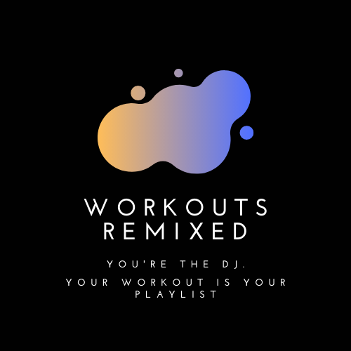
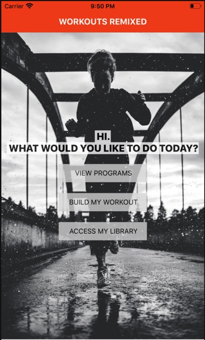
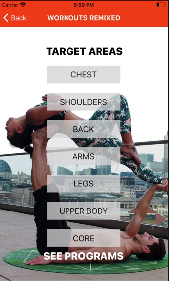

# Workouts Remixed

Created and designed as part of a 3-day Hackathon Project, Workouts Remixed was made for those who desire to have more artistic liberties over their workouts.

The app gives users access to pre-designed workout programs while also allowing them to design and store their own programs by accessing individual,targeted exercises as well as having the option to choose exercises or circuits from the pre-designed programs.

# Technologies

React Native, React Navigation, Express.js, Node.js, Javascript, Postgres, Sequelize.

# Screenshots

